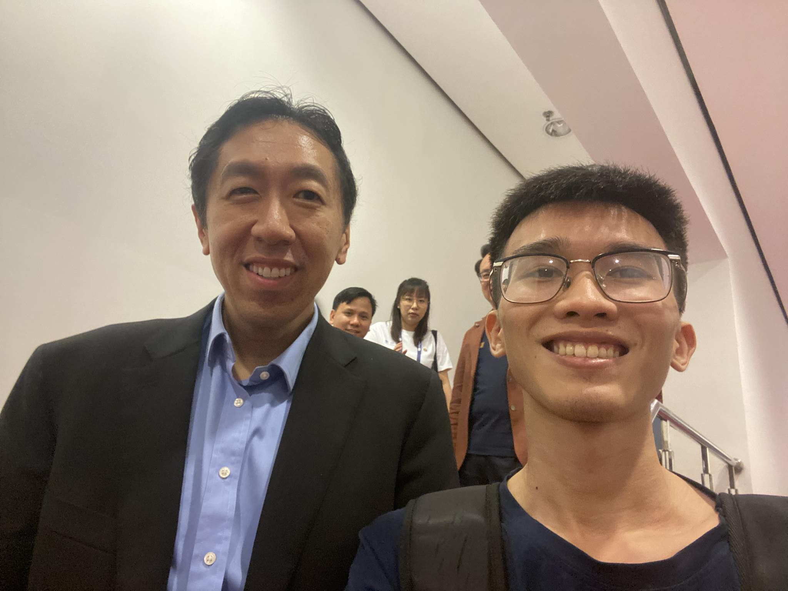

## Research and Development

In my perspective, there are two career paths: research and development. In concrete, Research is finding something new, and cool by reading and running experiments to evaluate the performance and then publishing to the world. On the other side, development- maybe we could call engineering, is building applications applied to resolving the pain point of users and it can be considered as the delivery to everyone, so everyone could use the technology for specific use cases.

Because of the need for my work, developing tools is more important than the research. I had to learn service tools, cloud platforms, and backend things to build our products. The last year, this was the time I stopped reading papers in the AI industry to spend more time on my work - the building application thing.

## The questions

Last week, I joined the FPT Tech Day 2023 in Hanoi to listen to the talk of Professor Andrew and find some interest in other teams in the AI company. I was inspired and thrilled by the revolution of AI.  Many of my old friends join the research track and now have a lot of achievements and so do the development track. They do a lot of high-impact and hard projects that need both strong background and enthusiasm. Through the talk, I can feel how they proud are of their work.

Poorly, I have no that feeling. Am I missing the cutting-edge models of the AI industry?  Why my friends’ teams are tackling a lot of interesting problems and very high-tech AI projects? Where was I? What was I doing now with tech tools? I will be a building guy or a research guy or both? How can I handle both or find a joint area? What I have been doing now? ... The questions - they are playing in my mind. Now, I am not in the best mood and my mind is so messy.

I regularly listen to podcasts in my free time. Mr [Hieu.TV](https://www.hieu.tv/) - my idol, he has a podcast channel to share his experience. At that moment, I thought about the part of one of his podcast videos, where he mentioned the context that he was skipping all career in Vietnam to start something new in Australia where he was starting from zero, and after that, he was facing a lot of obstacles. He was looking to his friends in Vietnam, they had a lot of fascinating companies, raising things, funding, and CEOs, … and he was questioning himself. I am not in the exact situation but I question myself too. The same is questioning myself.

## Parallel

However, some important parts are always there. There are some skills that are always needed for both paths. I am thinking about the English and the AI technology. Oh, maybe the best solution is to continue thinking about the “Who am I” question and still spend time on English and AI Technology too. These can be parallelized.

And now,  I am now coming back to read AI publications and learn English. I will write blog articles to share my views and my understanding when I was reading. This is a good way for me to archive and revise the docs. And for English, thankfully, I have some new friends. My friends share the same mindset and goals, I can practice English with them and learn from them about everything. They motivate me a lot. 

Let it be and see what will happen.