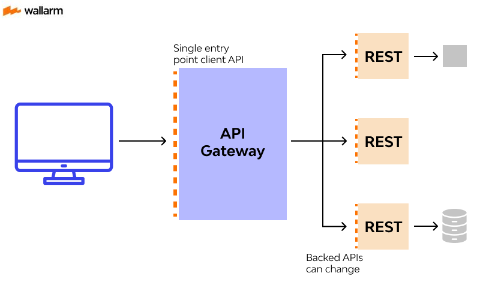

<i>Hà Nội, Time-Coffee, Chiều Chủ Nhật</i>

## The begin

Với sở thích là tìm hiểu và ứng dụng những công nghệ giải quyết những vấn đề trong thực tế. Mình rất thích làm được những công cụ như vậy. Để làm được điều đó, một người như mình cần phải học và rèn luyện nhiều kĩ năng về lập trình, tư duy. 

Mình sẽ coi blog tech như là một nơi để thuận tiện cho việc tim hiểu hơn, cũng như có một hành trình thú vị và chia sẻ với mọi người.

## From the APIX

Quãng thời gian làm việc tại công ty của mình, mình trải qua quá trình phát triển [APIX](https://apix.vn/hub) - một sản phẩm platform về API, là sàn trao đổi các sản phẩm về API dành cho các developer. Các developer có thể thương mại hoá được các tools của họ dưới dạng các API, ngược lại những developer có nhu cầu sử dụng có thể mua và sử dụng các API có trên platform. 

Với APIX, xương sống của platform này chính là phần về xây dựng một hệ thống API gateway. Nơi này đóng vai trò là một trung gian giao tiếp giữa những nơi có nhu cầu gọi (request) và những đầu ra cung cấp dịch vụ (upstream services). API gateway cần thiết cho APIX để xem nó là một đầu mối, lưu chuyển các yêu cầu đến đúng upstream services và trả về kết quả cho người yêu cầu.  Mình sẽ viết nhiều hơn về APIX trong những bài sau, còn bây giờ là thời gian dành cho API gateway. Với vai trò trung gian. Ngoài việc đóng vai proxy trong giao tiếp, API gateway còn đảm nhận một vài vai trò như:

- Monitoring và Logging: Giám sát, quản lý, thống kê hệ thống
- Authorization và Authentication: Bảo mật xác thực người gọi, và cơ chế chấp nhận quyền truy cập
- Load balancer: Cân bằng tải, tránh quá tải cho các upstream services
- Caching, …

Trong những đoạn tiếp, mình sẽ đi tìm hiểu từng cấu trúc thành phần cần có của 1 API Gateway

## Routing and endpoint management

Về routing, đây chính là điều tạo nên 1 API gateway (cổng). Cơ chế routing ở đây chính là việc “cổng” sẽ routing chuyển tiếp các requests từ client đến đúng với các upstream services. Thông thường, việc routing này dựa trên định danh của từng upstream service đã đăng kí với API gateway thông qua endpoint management: là việc đăng kí quản lý các service dựa trên endpoint

Ví dụ như API gateway có 2 endpoints được đăng kí: 1 là truy vấn thông tin về nhà cửa (/api/house), 2 là truy vấn thông tin về động vật (/api/animal). Hai endpoint được phân biệt với nhau dựa trên uri của endpoint đó, ở đây là (house và animal).  

Khi bạn A thực hiện requests đến API gateway dựa trên uri /api/house. API gateway sẽ có cơ chế về tìm kiếm route matching để xác định /api/house này ứng với service gì. Sau đó API gateway sẽ thực hiện chuyển tiếp request đến service tương ứng. 

## **Authentication and Authorization**

Sau khi đã xác định được đúng điểm đến, điểm đi của truy vấn, và thực hiện chuyển tiếp. Kế đến API gateway còn phải đảm bảo các tính chất về xác thực và phân quyền. 

Authentication: Xác thực người truy vấn, trả lời cho câu hỏi: Người nào đang thực hiện truy vấn này ? Ở trong ví dụ trước là xác định người truy vấn là bạn A, đến từ tổ chức nào

Authorization: Phân quyền truy vấn, trả lời cho câu hỏi: Người dùng này có được phép truy cập đến tài nguyên này hay không? Ở trong ví dụ trước là xác định việc bạn A truy vấn đến API về nhà cửa là có được phép hay không.

Với cơ chế này, thông thường, phương pháp phổ biến nhất là quản lý theo key (key-management). Mỗi truy vấn sẽ được gửi kèm theo key và Gateway sẽ sử dụng key này để xem người truy vấn là ai và quyền như thế nào. Mình sẽ nói chi tiết hơn khi viết cụ thể về một stack.

## **Traffic Control and Load Balancing**

Trong phần này, API gateway đóng vai trò là nơi đăng kí, điều tiết traffic để giảm tải cho các upstream service. 

Ví dụ trường hợp service API về animal có lưu lượng truy cập quá nhiều, gây quá tải cho service này. Do đó các developer đã deploy thêm các bản sao của service animal để có thể đảm bảo không bị quá tải. Sau đó, các bản sao này sẽ đăng kí với API gateway để làm một trung gian về load balancer.  Các truy vấn sẽ được phân bổ ra các bản sao và theo thứ tự dựa theo thuật toán ( đơn giản nhất là round robin - xoay vòng), đảm bảo các service này không bị quá tải.  Hơn nữa về phía người dùng, họ sẽ không cần quan tâm đến multi-services và hệ thống ở bên dưới, họ chỉ cần quan tâm đến endpoint chung của service đó.  

## **Request and Response Transformation**

Tiếp đến là phần kiểm soát các request và response. Các request từ client đến API gateway, API gateway đến service, response từ service về API gateway và response từ API gateway về client đều được kiểm soát về nội dung và biến đổi nếu cần thiết.

Các thành phần có thể kiểm soát đối với một Rest API như: về request có headers, body, params, query, uri, …, về response status code, mapping, data, …. Tất cả đều có thể chỉnh sửa trước khi gọi và trả về kết quả. 

Một số use-case cho cơ chế này bao gồm:

- Thêm các thông tin về request để gửi đến service như IP
- Biến đổi và chuẩn hoá các mã lỗi gửi đến client

## **Caching**

Đối với truy vấn, các truy vấn giống nhau lặp đi lặp lại luôn xảy ra, và có thể tiết kiệm tài nguyên và thời gian bằng cách sử dụng cơ chế caching. 

API gateway đã hỗ trợ sẵn cơ chế về caching ở lớp ngoài thay vì phải implement caching ở chính từng service. Điều này giúp giảm thời gian thực hiện truy vấn, tiết kiệm thời gian implement. 

Cơ chế caching ở API gateway cũng được implement theo đúng chuẩn best-pratice, thường sử dụng key để đăng kí cached object được lưu trữ ở cached memory hoặc cached DB trong một khoảng thời gian sống (ttl). 

## **Rate Limiting and Throttle Limiting**

Đây chính là phần hay ho của API gateway - kiểm soát về rate limit và throttling, tức là hạn chế số lượng requests đến API gateway và cả services trong một khoảng thời gian nhất định. 

Trong trường hợp, service về animal chỉ chịu đựng được 4 requests/second thì khi có đồng thời 5-10 requests đến cùng lúc trong 1 second thì service sẽ bị down ngay. Ngoài ra nếu lỡ service bị tấn công DDOS với số lượng cực lớn 1k requests/second. Để tránh điều đó thì Rate Limit and Throttle Limit ra đời. 

Cơ chế này sẽ hoạt động như sau. Trong một khoảng thời gian, khi một client thực hiện requests quá nhiều lần, vượt quá ngưỡng cho phép đăng kí trước đó của service, thì API gateway sẽ không thực hiện chuyển tiếp mà trả về lỗi ngay dành cho client: *429 Too Many Requests.*  Nếu như không có API gateway, các services phải tự implement cơ chế này để bảo vệ chính nó, cũng giống như cơ chế caching. Khi có API gateway, các cơ chế này được đẩy ra lớp ngoài, do đó ở các service chỉ cần tập trung implement các logic mà thôi. 

## **Logging and Monitoring**

Và cuối cùng, chính là những hỗ trợ về log và monitor. Các truy vấn thông qua API gateway đều được config để lưu log lại và có thể quản lý được thông qua CRM ( như ở AWS) hoặc access by code. Việc lưu trữ lại log giúp cho các developer có thể debug được những bug từ các service. Ngoài ra còn có một số stack về API gateway hỗ trợ các tools giúp mình có thể analystics monitor hoặc xem các dashboard một cách dễ dàng.  

## The conclusion

Trên đây là một số thông tin căn bản và tổng quan về API gateway - như một phần introduction cho những bài blog về tech của mình. Trong bài tiếp theo, mình sẽ viết kĩ hơn về các dịch vụ về API gateway của AWS, Kong, … và những trải nghiệm của mình khi sử dụng chúng. 

## References

- [https://tyk.io/secure-shape-and-transform-traffic/](https://tyk.io/secure-shape-and-transform-traffic/)
- [https://viblo.asia/p/tim-hieu-aws-api-gateway-RnB5pMW2KPG](https://viblo.asia/p/tim-hieu-aws-api-gateway-RnB5pMW2KPG)
- [https://aws.amazon.com/vi/api-gateway/](https://aws.amazon.com/vi/api-gateway/)
- [https://www.youtube.com/watch?v=6ULyxuHKxg8&t=20s](https://www.youtube.com/watch?v=6ULyxuHKxg8&t=20s)
- [https://www.youtube.com/watch?v=KeZhT5pLn4c](https://www.youtube.com/watch?v=KeZhT5pLn4c)
  

