<i>Hà Tĩnh, Quê hương coffee, Chiều thứ 6</i>

## The Begin

Cơ duyên của mình đối với AWS - Amazon Web Services đến khi dự án mới của công ty mình chuyển sang dùng 100% dịch vụ của AWS - một thứ mới mẻ với các anh em trong công ty và với mình. 

Dịch vụ đầu tiên của AWS mà mình tìm hiểu sử dụng là API Gateway, cũng là core để xây dựng nên APIX phiên bản đầu tiên. Trong bài này mình sẽ tìm hiểu tất tần tật về dịch vụ này.

> Amazon API Gateway is an AWS service for creating, publishing, maintaining, monitoring, and securing REST, HTTP, and WebSocket APIs at any scale.
> 

## Excellent views:  AWS API Gateway

AWS chia service của họ thành các lát cắt tương ứng với quá trình thao tác với API Gateway. Rất dễ hiểu khi mới sử dụng. 

- Develop: Tất cả các setup liên quan đến API về cấu hình, kết nối, …
- Deploy: Các setup liên quan việc deploy các API lên API gateway
- Monitor: Các kết nối sang logs
- Protect: Các setup liên quan đến throttle, rate limit
- Optimize: Các tối ưu bao gồm caching, compression
- Distribute: Các setup liên quan đến gói sử dụng, key của client

## Develop: API Gateway

Đây là thuật ngữ chỉ chung về gateway, là lớp ngoài cùng cho phép tạo, deploy, quản lý và theo dõi các API có trong gateway. API gateway của AWS hỗ trợ kết nối với các service theo ba dạng: REST API, HTTP API, Websocket API. Nói về phần core của API gateway thì việc quản lý hay HA core đều thuộc về AWS. Nghĩa là mình không cần bận tâm đến việc deploy API gateway mà mỗi account sẽ được hay coi như được cấp 1 gateway ( manage by AWS) và việc của mình chỉ là setup và sử dụng các APIs trong gateway đó.

## Develop: APIs

Khái niệm API ở AWS service để chỉ 1 tập-bộ các API endpoint hướng đến một số nhiệm vụ chung. Mỗi API sẽ được định danh bởi ID và được setup theo nhiều loại kết nối kể trên.

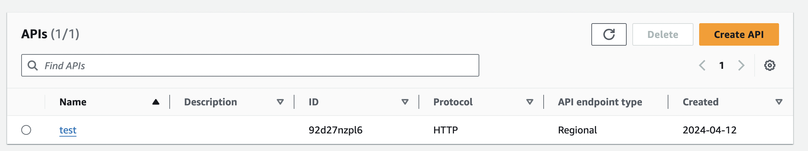

## Develop: API Routes

Khi client gọi đến API trong Gateway thì Gateway sẽ dựa vào route để tiến hành gọi xuống các service tương ứng đã được setup. Do đó việc đặt tên và định danh cho route là bước quan trọng đầu tiên khi mình setup API. 

Các route được định danh bên tên của nó. Ví dụ với routes là /pets.  Mình có thể xác định các method (đề cập sau) cụ thể cho route của mình. Hoặc, mình có thể sử dụng phương thức ANY để phù hợp với tất cả các phương thức mà chưa xác định. Ngoài ra mình có thể tạo một route $default hoạt động như một route mặc định sẽ bắt hết các request mà không được xác định.  

Với cặp Route và Method sẽ định danh đến service.

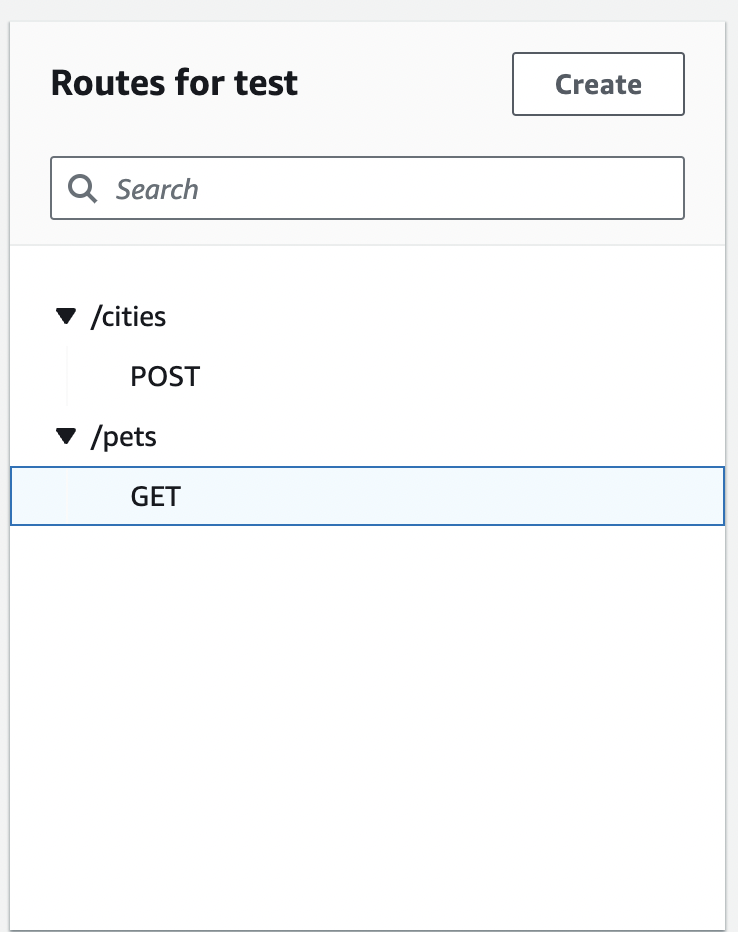

## Develop: API Authorizers

Với mỗi route, AWS sẽ chìa ra ở một dạng attach route với một lớp bảo vệ Authorizer. Cơ chế này còn được gọi là Access Control. Mỗi Authorizer sẽ có nhiệm vụ bảo vệ, kiểm soát và xác minh các request có hợp lệ hay không. Một số kiểu cơ chế có thể sử dụng:

- **Lambda authorizers:** Sẽ sử dụng một hoặc nhiều hàm Lambda để làm hàm verify. Cách làm này có lợi thế là mình có toàn khả năng custom logic theo ý muốn. Nôm na với một hàm đầu vào với thông tin của request và API, mình phải viết logic 1 hàm để trả về chấp nhận hay không request này. Hàm Lambda Authorizer sẽ luôn được gọi ngay sau khi xác định được route và trước khi gọi xuống service. Đây là cách mình sử dụng trong dự án APIX. Các logic liên quan đến Authorization hay Limit Quota, Subscription đều được xử lý tại bước này.
- **JWT authorizers:** Sử dụng lại cơ chế JWT truyền thống. Xem thêm tại: [Controlling access to HTTP APIs with JWT authorizers](https://docs.aws.amazon.com/apigateway/latest/developerguide/http-api-jwt-authorizer.html).
- **Standard AWS IAM roles and policies:** Cơ chế này sử dụng AWS IAM roles. Mình chưa tìm hiểu kĩ nên đọc thêm ở đây nhé: [Using IAM authorization](https://docs.aws.amazon.com/apigateway/latest/developerguide/http-api-access-control-iam.html).

## Develop: API Methods

API methods chính là các phương thức tiến hành gọi vào API. Các Methods bao gồm: GET, POST, PUT, DELETE, PATCH, ANY ( đây là phương thức nhận toàn bộ các phương thức)

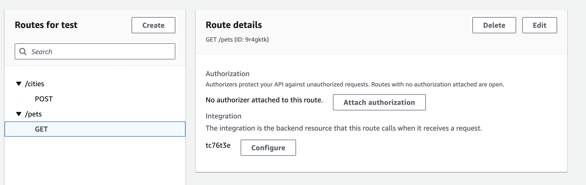

Khi mình setup method thì ngoài việc xác định rõ phương thức của API đó thì còn đồng thời setup thêm về request params, payload, header bắt buộc khi gọi. Đối với output thì mình phải setup status code, headers và body trả về dựa theo response từ các service backend. 

## Develop: API Integration

Integration chính là kết nối từ gateway đến các upstream service ở phía dưới. Hãy tưởng tượng, sau khi tiến hành tìm kiếm và matching được request từ client và route có trong gateway. Với mỗi route và method, sẽ gọi xuống integration ứng với nó. 

Hiện tại Integration trong AWS hỗ trợ kết nối theo các dạng sau: 

- AWS lambda service: Gọi thẳng xuống lambda của AWS ( cũng là 1 dịch vụ serverless của AWS)
- HTTP API: Gọi đến 1 public HTTP API, đây là kiểu proxy integration. Ví dụ mình có 1 service riêng ở  `https://petstore-khang.com/pets` . Sau khi mình attach HTTP integration này vào với route và method GET /pets thì khi gọi client gọi đến GET /pets, các thông tin về request sẽ được call xuống về  service của mình là `https://petstore-khang.com/pets`. Ngoài ra mình có thể cài đặt về timeout - thời gian phản hồi tối đa của 1 request đến Integration này, nếu vượt quá sẽ raise lỗi.

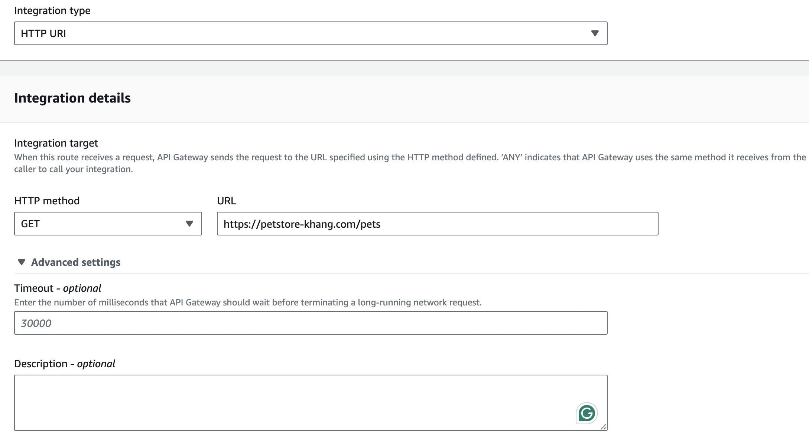

Ở API Integration có một nhiệm vụ nữa đó là transform các request, response đến upstream service. Gọi tắt là Parameter Mapping. 

- Transform API requests: Ở đây mình có thể thay đổi thông tin của request trước khi gửi đến upstream service như thay đổi, thêm, sửa, xoá các header, querystring, và path, … Với ví dụ dưới là thêm giá trị của querystring và header với cặp key-value là {name: Khang} và {fromService: Amazon}. Với setup này thì ở dưới service sẽ nhận được giá trị tương ứng. Ngoài việc sử dụng các static value thì AWS còn support các value ở dạng tĩnh để có thể bắt được các context khi gọi như địa chỉ IP, Region, …
    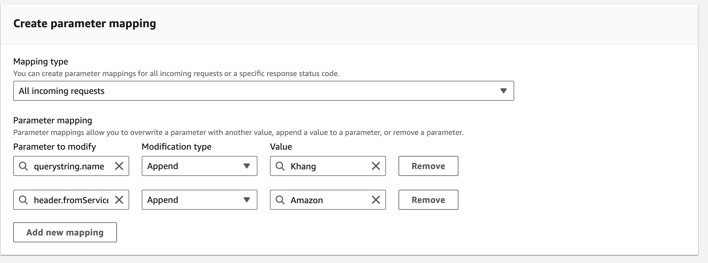
    
- Transform API response: Ở đây sau khi nhận response từ upstream service, mình có thể thay đổi các thông tin của response ví dụ như headers, status code, body, … Cũng như ở trên, ở đây mình thay đổi status code từ 200 về 202 và thêm 1 header trả về là change = True
    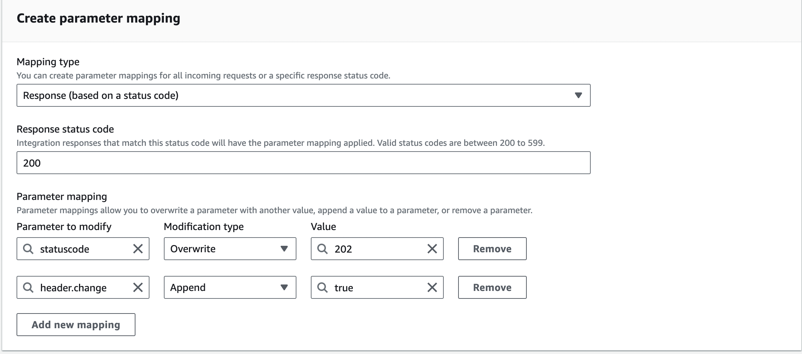

## Deploy: API Stage and API Deployment

Với API Stage là đến giai đoạn setup xong cấu hình của API, chuyển sang giai đoạn publish API ra ngoài. API Stage là một định danh logic chỉ stage của API đó trong Gateway. Ví dụ như dev, prod, v1, v2. Và nó sẽ được gắn vào URL expose ra bên ngoài gọi là Invoke URL. Trong mỗi stage thì có các configure để có thể tự động deploy mỗi khi có thay đổi ở cấu hình API.

Với API Deployment, là một bản snapshot của cấu hình API và được gắn với API và Stage. 

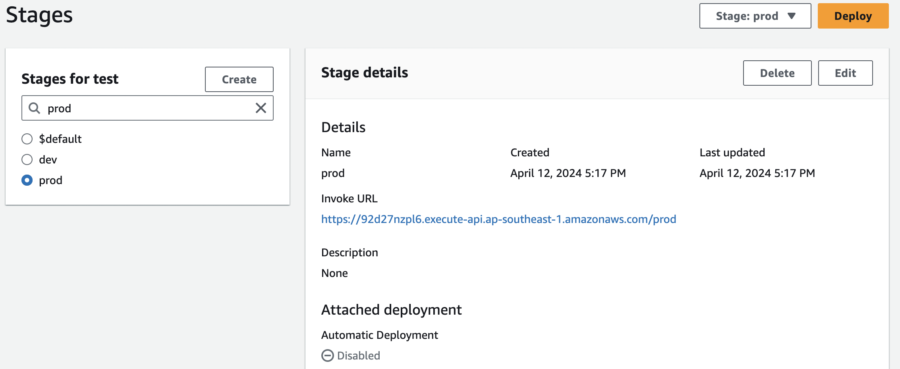

## Deploy: Custom Domain Name

Sau khi deploy thành công API tương ứng với stage, Ví dụ như trên với Invoke URL khá xấu và để lộ ra thông tin cấu hình. Trong thực tế, chúng ta sẽ sử dụng Domain Name để thay thế cho URL này. 

Sau khi tiến hành register domain hợp lệ và chúng ta thiết lập lại cơ chế Mapping như sau. Sau đó thay vì gọi vào Invoke URL, chúng ta sẽ gọi API thông qua Domain Name URL của mình. 

| https://khang.api.example.com/prod | https://92d27nzpl6.execute-api.ap-southeast-1.amazonaws.com/prod |
| --- | --- |

## Monitor: Logging

Khi đã hoàn thành việc setup về cả develop và deploy. Thì kế tiếp là giai đoạn setup về Logging để tiến hành Monitor.  Ở đây AWS hỗ trợ việc setup lưu lại các Access Log - là các Log liên quan đến request và response. Thông thường ở đây mình sẽ chọn luôn Log Destination là một Log Group trong AWS CloudWatch.  Nội dung của từng record log sẽ được mặc định và thêm bớt theo format như dưới. Ví dụ như mình muốn log về IP thì dùng $context.identity.sourceIP.  Tuỳ vào trường hợp mình cần lưu log record như thế nào để dễ dàng tracking và làm các tác vụ thống kê sau này. 

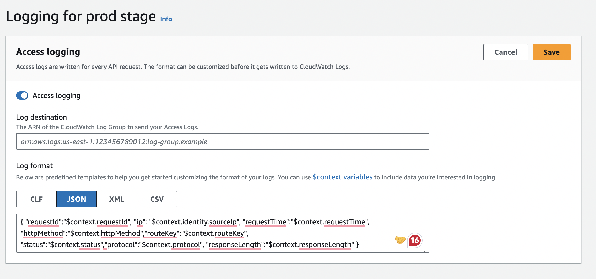

## Protect: Rate limit and Burst limit

Như đã đề cập ở [bài trước về API Gateway nói chung](https://khangt1k25.github.io/tech/api_gateway/:). Các tính năng về Limit là thứ không thể thiếu ở API Gateway. Ở AWS, họ đã đưa phần Limit này vào Protect Views - dưới dạng API limit. Nghĩa rằng, với mỗi API mình sẽ được setup các cấu hình limit riêng. Core nằm bên dưới của họ vẫn là thuật toán về Bucket để đếm token counter cho một định danh truy vấn.  Với một cấu hình thì có thể setup 2 thông số

- Rate Limit : số request nhận tối đa trong một giây đồng hồ
- Burst Limit: Số request tối đa được xử lý tại một thời điểm

Ngoài ra còn support Limit dựa trên Account

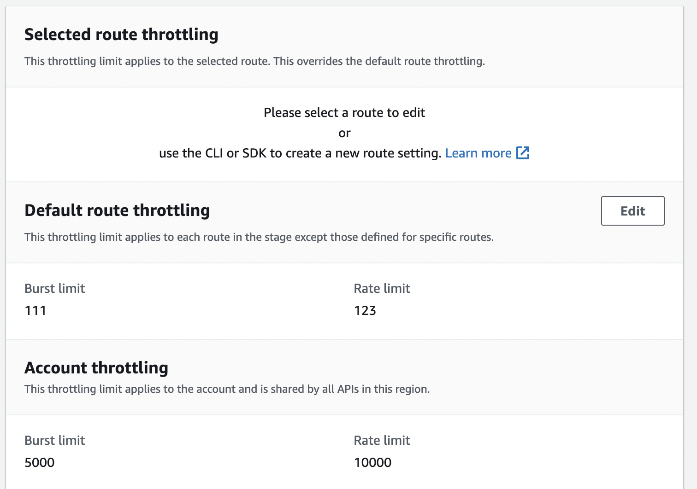

## Optimize: Caching

Sau khi hoàn thành các view trước, đây là view addons với tên là Optimize - nhằm tối ưu việc sử dụng và quản lý API Gateway. Trong đó, một cách tối ưu đơn giản và hiệu quả đó là Caching. Với Caching thì sẽ làm giảm được số lần mà API Gateway gọi xuống các service do các kết quả đã được cache lại (gọi là cached response) và trả về ngay.  Thời gian lưu trữ của cached response dựa theo thông số TTL ( time-to-live) xác định khoảng thời gian tồn tại của 1 cached response object trong hệ thống.  

## Distribute: Usage Plan and API Key

Usage plan là một gói sử dụng API, khi được gắn với API và Client, nó sẽ xác định ra bộ limit tương ứng dành cho người đó khi gọi API.  Ta có thể setup các thông số về Rate, Burst cho gói, ngoài ra còn có thông số về Quota, xác định hard limit dành theo ngày/tháng/tuần. Ví dụ: Gói free ở dưới được cấu hình rate = 100, burst = 100 và quota cho 1 tháng sử dụng là 10K requests.

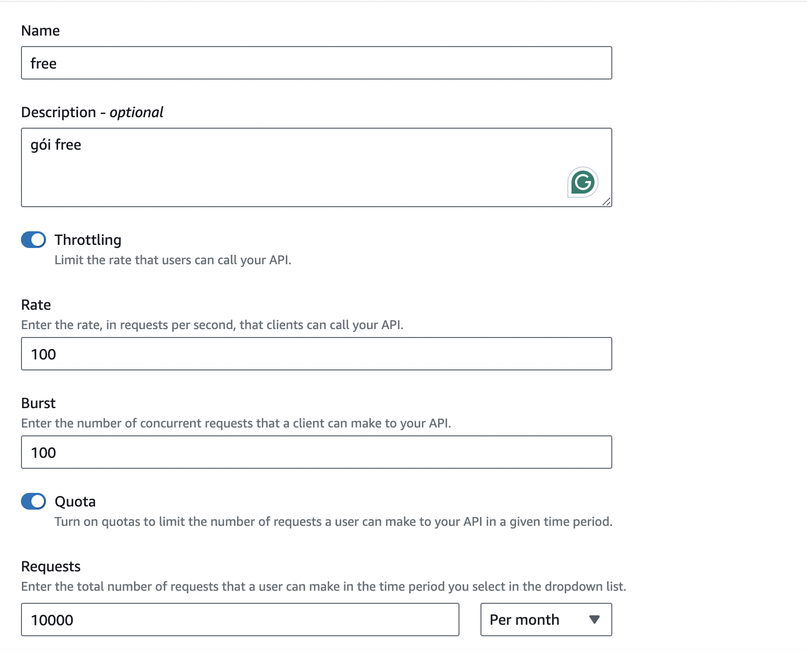

API key là một đoạn string được generate ra và sẽ đưa cho client sử dụng. Một API Key sẽ có name ( tên của key) và value ( giá trị là đoạn string - cần được giữ bí mật, chỉ client nhất định mới có được giá trị này). Client sẽ sử dụng API Key này để gọi đến API Gateway. Về mặt API Gateway, nó sẽ không quan tâm bên ngoài là Client nào mà sẽ chỉ quan tâm đến Key nào vừa gọi ? Key đó có quyền Access hay không ? Khi design hệ thống có thể coi 1 API key là 1 user hoặc 1 group. 

Giờ là bước **Associated** giữa API, Usage plan và API Key. Phải trả lời hai câu hỏi sau đây.

Gói free này sẽ sử dụng trên API nào? AWS sẽ cho phép ta cấu hình **Associated stages.**  Ta sẽ gắn gói free với một API Stage với câu trả lời rằng: Gói free này sử dụng trên API này.

Ai sẽ sử dụng gói free này?  Ta sẽ **Associate API Key** của client 1 vào để client 1 có thể sử dụng gói free.  

Sau khi xong bước này, client 1 có thể gọi đến API với gói là free - có các thông số như cấu hình ở gói. 

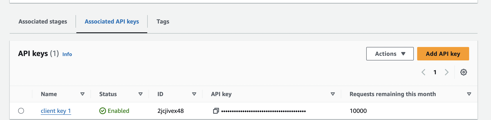

## Advantages

Sau quá trình sử dụng AWS API Gateway để build lên hệ thống API marketplace trong dự án của công ty. Mình nhận thấy đây là một service siêu tiện dụng đến từ nhà AWS và hướng đến việc tối giản hoá các bước khi tạo API Gateway. Một số ưu điểm theo mình cảm nhận:

- Tiện lợi, dễ dùng, không cần phải code custom quá nhiều, phù hợp cho các API gateway không cần custom quá nhiều
- Không cần phải HA, chịu tải và scale  - đã có AWS lo
- Có các documen rất clear và có use-case cụ thể để mình tham khảo và quan trọng là có API, SDK chìa ra để setup
- Dễ dàng kết nối đến các  Internal Service của nhà AWS.

## Disadvantages

Ngoài những ưu điểm về dễ dàng sử dụng thì sau đây là cảm nhận của mình không thích khi sử dụng AWS API Gateway, đó cũng là những tham khảo để các bạn có thể lựa chọn stack phù hợp nhé. 

- Tính customize thấp, là sự trade off giữa sự đơn giản và tính mạnh mẽ. Đối với mình thì khi sử dụng, mình ưu tiên tính customize này hơn do sự phức tạp của một sàn API team xây dựng. Ví dụ chỉ có 1 Authorizer là không đủ và tốc độ chậm khi xử lý toàn bộ các tác vụ customize trước khi gọi request.
- Bị limit rất nhiều: Các Limit về số API, số Endpoint hay về Protect đều có giới hạn trên ở mỗi tài khoản, và phải liên hệ để extend ra. Không chỉ vậy thì một số cấu hình còn bị hard limit ( không thể mở rộng hơn ). Điều này ảnh hướng rất nhiều đến cấu trúc các APIs. Do đó trước khi xây dựng nên tìm hiểu kĩ phần limit này để design hợp lý. Chi tiết xem thêm [tại đây](https://docs.aws.amazon.com/apigateway/latest/developerguide/limits.html)

## The Conclusion

Đó là những trải nghiệm của mình và đây cũng coi như một buổi review về AWS API Gateway. Tuy có những ưu điểm và là nơi rất tốt để bắt đầu, nhưng mình nghĩ đây không phải là lựa chọn tốt cho những hệ thống phức tạp.  Do đó, mình cũng sang tìm hiểu tech stack khác về API Gateway và cái tên tiếp theo đó là Kong Gateway. Và sẽ lại là một hành trình tiếp theo để build cùng với Kong. Mình sẽ kể về nó ở phần sau.

Xem lại bài trước nhé:
* [The very first: API Gateway](/tech/api_gateway/)

## References

- https://docs.aws.amazon.com/apigateway/latest/developerguide/apigateway-rest-api.html
- https://viblo.asia/p/tim-hieu-aws-api-gateway-RnB5pMW2KPG
- https://docs.aws.amazon.com/apigateway/
- https://www.youtube.com/watch?v=sDxsTPbUiik
